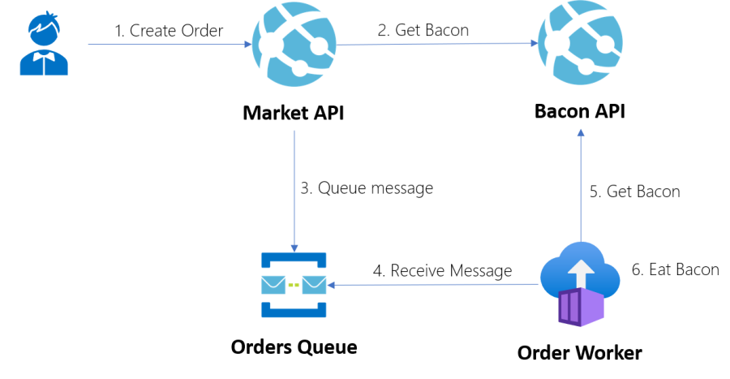
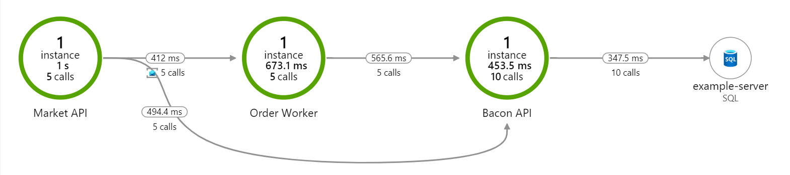
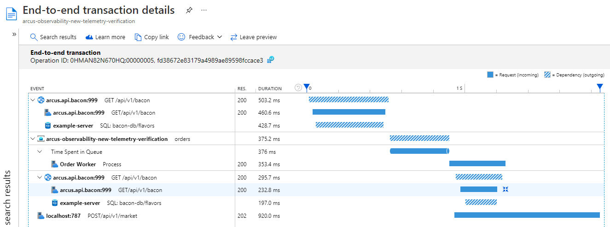
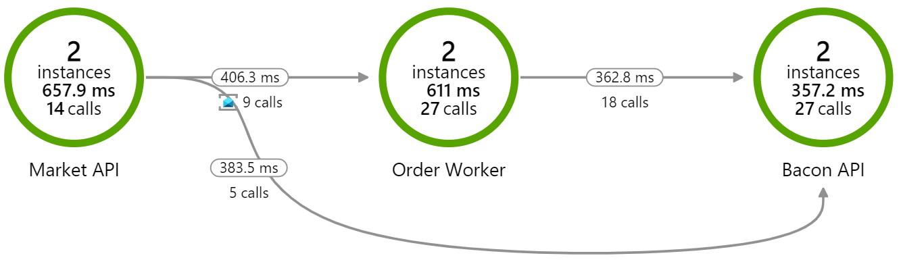
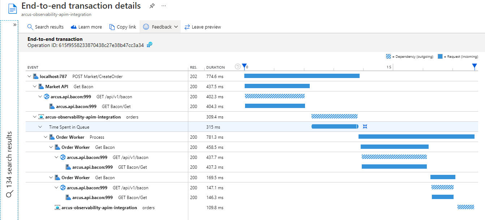

# Arcus - Service-to-Service Correlation POC

POC to have end-to-end correlation stitching operations across services together in the Azure Application Insights Application Map.


## Scope

Provide end-to-end correlation stitching operations across services together in the Azure Application Insights Application Map.

When creating an order, the following flow occurs:



### Requirements

- Correlate across services in the Azure Application Insights Application Map
    - Support for HTTP dependencies
    - Support for Service Bus dependencies
- Correlate multiple interactions in the same operation & component, in a tree-manner
- Ensure the measured dependencies are comparable to the native Azure Application Insights telemetry

### Official Telemetry Correlation Guidance

As per [the guidance](https://docs.microsoft.com/en-us/azure/azure-monitor/app/correlation#data-model-for-telemetry-correlation):

> Application Insights defines a [data model](../../azure-monitor/app/data-model.md) for distributed telemetry correlation. To associate telemetry with a logical operation, every telemetry item has a context field called `operation_Id`. This identifier is shared by every telemetry item in the distributed trace. So even if you lose telemetry from a single layer, you can still associate telemetry reported by other components.
> 
> A distributed logical operation typically consists of a set of smaller operations that are requests processed by one of the components. These operations are defined by [request telemetry](../../azure-monitor/app/data-model-request-telemetry.md). Every request telemetry item has its own `id` that identifies it uniquely and globally. And all telemetry items (such as traces and exceptions) that are associated with the request should set the `operation_parentId` to the value of the request `id`.
> 
> Every outgoing operation, such as an HTTP call to another component, is represented by [dependency telemetry](../../azure-monitor/app/data-model-dependency-telemetry.md). Dependency telemetry also defines its own `id` that's globally unique. Request telemetry, initiated by this dependency call, uses this `id` as its `operation_parentId`.
> 
> You can build a view of the distributed logical operation by using `operation_Id`, `operation_parentId`, and `request.id` with `dependency.id`. These fields also define the causality order of telemetry calls.

This means that we are handling the operation ID (aka `operation_Id`) correctly today, but we need to:

- Provide tracking of parent IDs for operations (aka `operation_ParentId`)
- Keep track of the unique IDs for request telemetry items, to use as parent ID for other telemetry
- Keep track of the unique IDs for dependency telemetry items, to use as parent ID for other telemetry

Learn more in [this example](https://docs.microsoft.com/en-us/azure/azure-monitor/app/correlation#example).

### Current Status

- [x] Provide support for linking service-to-service interactions across components through HTTP
- [x] Provide support for linking service-to-service interactions across components through Azure Service Bus
- [x] Provide support for tracking requests from an Azure Service Bus queue
- [x] Provide convenient way to correlate across services through HTTP
- [x] Provide convenient way to correlate across services through Azure Service Bus
- [x] Provide operation names for Request, Dependency, Event & Metric
- [x] Provide better target names for depenendencies
- [x] Provide source information for Service Bus requests
- [ ] Remove all Arcus code that has not been changed
- [ ] Provide fully identical end-to-end transaction details similar to official SDK
- [ ] Provide documentation on how it works & required actions

Here is what the end-to-end correlation across component looks like:



When looking at the telemetry tree, it looks as following:



### What is not included

- Integrate Azure API Management with our Arcus Observability (see [arcus-azure/arcus-api-gateway-poc](https://github.com/arcus-azure/arcus-api-gateway-poc) instead)

## Getting Started

Before you can run this, you need to:

1. Run solution with Docker Compose
2. Get bacon by calling the API - GET http://localhost:789/api/v1/bacon
3. Create order to eat bacon asynchronously by calling the API - POST http://localhost:787/api/v1/market
```json
{
    "amount": 2
}
```

## How Does it Work with Azure Application Insights SDK?

> 💡 This is currently achieved by using the Azure Application Insights SDK.
>    We will port this to purely `TelemetryClient` to know where we need to track what.

Here is what the end-to-end correlation across component looks like:



When looking at the telemetry tree, it looks as following:



You can download the raw telemetry [here](raw-telemetry.csv).

### Learnings

- The `operationId` is identical in every component, so we have to propogate it to correlate across components.
- The `id` of the dependency in the initial component must match the `operationParentId` of the request in the second component.

We can leverage the same capabilities through Serilog if we get inspiration from the Azure Application Insights SDK:

- How they pass the request information ([code](https://github.com/microsoft/ApplicationInsights-dotnet/blob/develop/WEB/Src/Web/Web/HttpContextExtension.cs#L16))
- [`OperationCorrelationTelemetryInitializer`](https://github.com/microsoft/ApplicationInsights-dotnet/blob/develop/WEB/Src/Web/Web/OperationCorrelationTelemetryInitializer.cs)
- [`RequestTrackingTelemetryModule`](https://github.com/microsoft/ApplicationInsights-dotnet/blob/develop/WEB/Src/Web/Web/RequestTrackingTelemetryModule.cs)
- [`OperationNameTelemetryInitializer`](https://github.com/microsoft/ApplicationInsights-dotnet/blob/develop/WEB/Src/Web/Web/OperationNameTelemetryInitializer.cs)
- [`AuthenticatedUserIdTelemetryInitializer`](https://github.com/microsoft/ApplicationInsights-dotnet/blob/develop/WEB/Src/Web/Web/AuthenticatedUserIdTelemetryInitializer.cs)

## Action items

- [ ] Support operation (parent) IDs with `:`
- [ ] Provide a convenient way to automatically support service-to-service correlation with `HttpClient`
- [ ] Provide a convenient way to automatically support service-to-service correlation with Service Bus (extension?)
- [ ] Provide support for tracking a request source (Azure Service Bus only)
- [ ] Improve target names for depenendencies
- [ ] Provide support for upstream operation IDs with Arcus Messaging
- [ ] Provide name for all dependency and request telemetry items
- [ ] Upgrade Arcus Observability dependency in Arcus Messaging to v2.x, instead of v0.x

_Some of the action items can be easily found by searching for `TODO: Contribute Upstream` or using the Task List._

## Clarification Required

None at the moment.